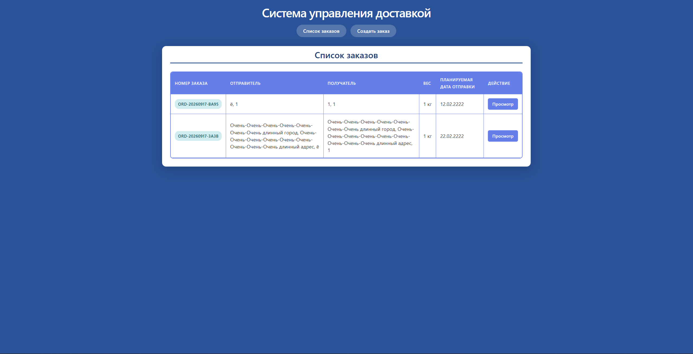
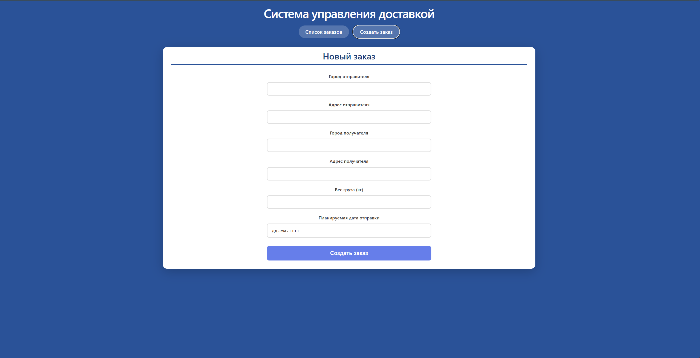
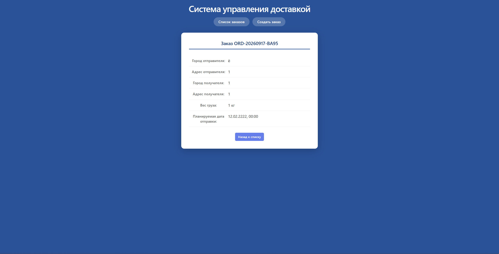

# Система управления доставкой

Web-приложение для создания и управления заказами на доставку груза.

## Стек технологий

- **Backend**: ASP.NET Core 9 Web API, Entity Framework Core 9, SQLite
- **Frontend**: React 18, Vite 5, Axios, React Router
- **Контейнеризация**: Docker, Docker Compose, Nginx
- **Документация API**: Swagger (Swashbuckle)

## Функционал

- Создание заказа на доставку (город и адрес отправителя/получателя, вес груза, дата отправки)
- Просмотр списка всех заказов с автоматически сгенерированным номером
- Детальный просмотр заказа в режиме чтения
- REST API с валидацией данных

## Быстрый старт

### С помощью Docker

```bash```

git clone [https://github.com/AlRyabinin/Kanban.git](https://github.com/AlRyabinin/DeliveryApp)

cd DeliveryApp

docker-compose up -d --build

## Скриншоты


*Основная страница*


*Форма создания нового заказа*


*Форма с деталями заказа*
